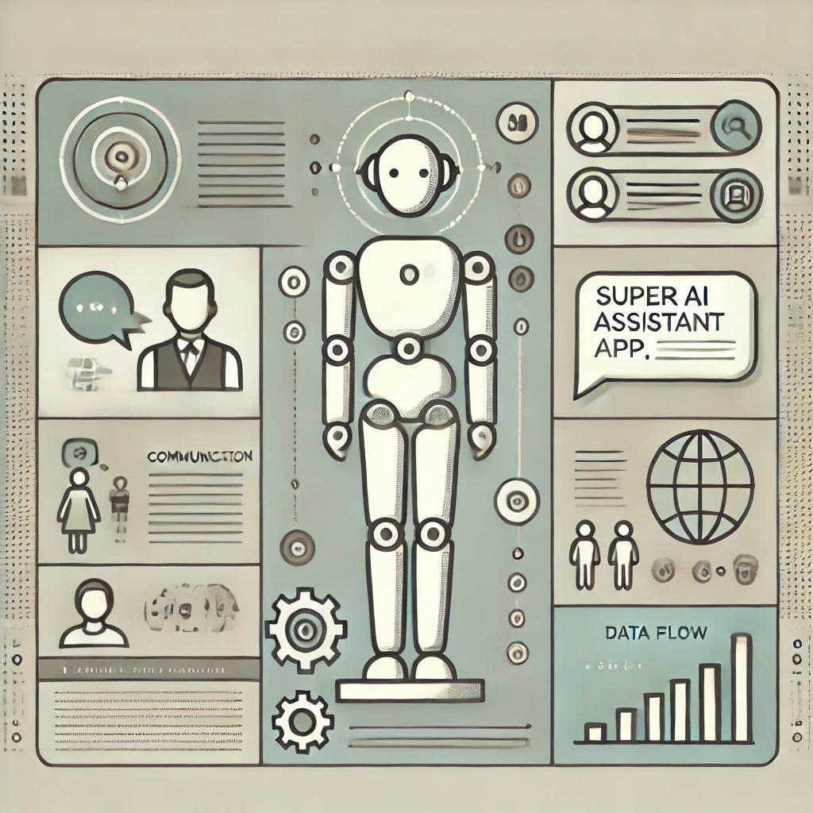
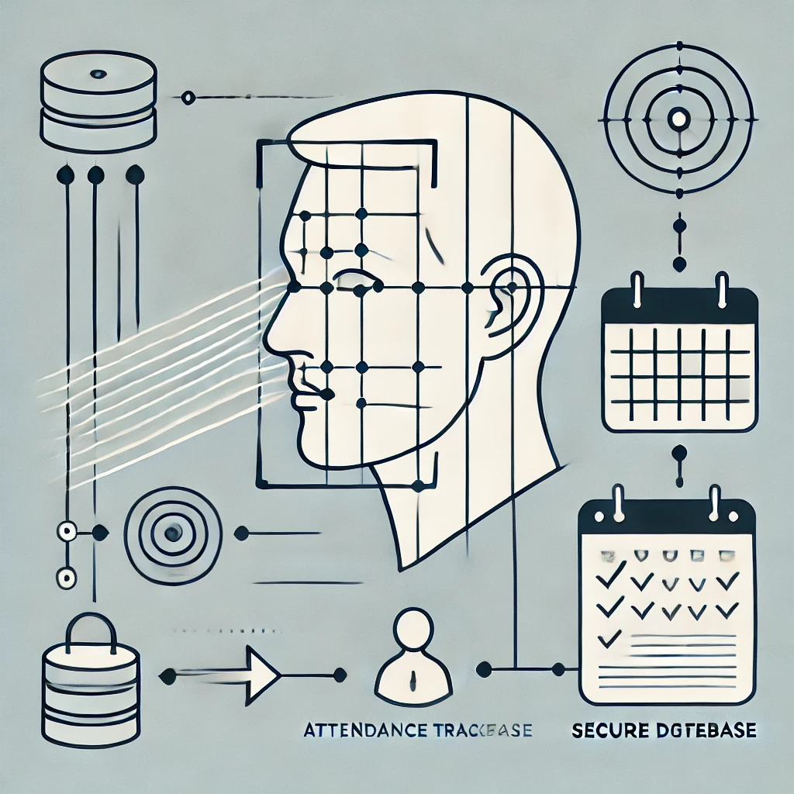

# Artificial Intelligence Engineer

#### Technical Skills: Python, SQL, TensorFlow, Hugging Face, Langchain, Retrieval-Augmented Generation (RAG), AWS

## Education

- B.S., Computer Science | COMSATs University Islamabad, Vehari, Pakistan (_February 2023_)

## Work Experience
**AI Assistant Engineer @ Metatalent.ai (_November 2023 - February 2024_)**
- Led the implementation of NLP models for recommendation systems and generative AI, enhancing user engagement by 18%.
- Integrated AI solutions into production by collaborating with cross-functional teams, ensuring alignment with business goals.
- Developed and deployed chatbot systems using cutting-edge NLP techniques, improving customer interactions.

**Data Scientist Intern @ Metatalent.ai (_August 2023 - November_)**
- Managed data collection, cleaning, and preprocessing for machine learning models, reducing processing time by 20%.
- Developed predictive models using Python, Pandas, and Scikit-learn, boosting business prediction accuracy by 10%.
- Created data-driven reports that informed strategic decisions and AI development initiatives.

**Generative AI and NLP Projects (_Personal Experience_)**
- Built an AI-powered document retrieval system using LangChain and RAG, improving search efficiency for large datasets.
- Developed a chatbot using Amazon Bedrock and Hugging Face transformers, enabling real-time question answering from multiple PDF documents.
- Created a blog generation app using GPT models and Docker, automating content creation for multiple platforms.

## Projects
### RAG LLM App from Multiple PDFs

Developed an advanced Retrieval-Augmented Generation **(RAG)** system using **Amazon Bedrock** to efficiently extract relevant information from multiple PDFs. Implemented fine-tuning techniques on the language model, which resulted in a 20% improvement in query response accuracy and a 15% reduction in response time by enhancing document retrieval processes.

### Super AI Assistant App

Designed and developed a multi-functional AI assistant using **Google Gemini API** and **Groq API**, providing users with the ability to switch between Google Gemini and open-source models. Integrated multi-modal inputs, including text, images, audio, video, and documents, to enhance user interaction. Incorporated features like voice response, continuous conversation with chat history, agent-based tasks, and summarization for web pages and YouTube videos, boosting user engagement by 20%.

### Face Attendance System

Created a face recognition-based attendance system using Convolutional Neural Networks (CNNs) for real-time facial detection and recognition, achieving 95% accuracy. Enhanced the system with OpenCV for image preprocessing and integrated it into a secure database, resulting in a 30% improvement in attendance tracking efficiency in live environments.

